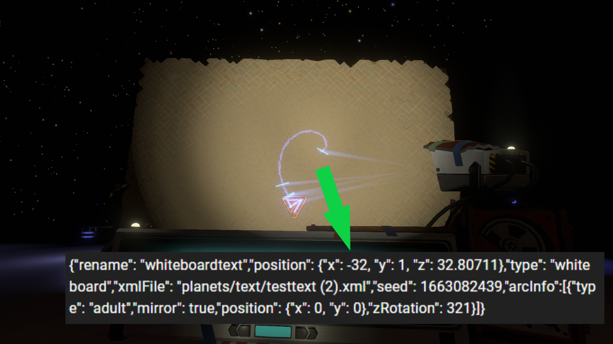

# Nomai Text Printer

A utility mod for use with New Horizons, making it easier to save changes made with the [Unity Explorer Mod](https://outerwildsmods.com/mods/unityexplorer/). 
By aiming the translator at a text and pressing the configurable key (default M), you can print all of the information about the Nomai text you are targeting directly to the OWMM console. This text is automatically formatted as a json string, so you can copy it directly into the json file for your planet! 
This works fully with any form of TranslatorText that can be placed with New Horizons, including things like recordings and computers.

# Tracked Changes
All of these features should be tracked via the game object. This means that changes made to these features (using something like Unity Explorer) will be reflected in the string printed to the console: 
(Please note that the root GO may be different depending of what type of text you are inserting (wall text vs. a recording))
- Renaming the root GO of the text (reflected in the "rename" json field)
- Changing the parent of the root GO of the text (reflected in the "parentPath" json field)
  - If a parentPath is found, then "isRelativeToParent" will be automatically set to true
- Repositioning the root GO of the text (reflected in the "position" json field)
- Rotating the root GO of the text (reflected in the "rotation" json field)
- Changing the location property in the NomaiText component (reflected in the "location" json field)

Most useful of all, changes made to individual text arcs are tracked:
- The type of text arc (reflected in the "type" json field)
  - The material of the arc is used to detect this, so copying a material from one arc to another will correctly change this. If you do this, you'll probably also want to copy the mesh to get it to look right.
- Whether or not the arc is mirrored (reflected in the "mirror" json field)
  - This is determined by checking if the x portion of the arc scale is negative. You can make the x value positive or negative using Unity Explorer to take advantage of this.
- The position of the arc (reflected in the "position" json field)
- The rotation of the arc (reflected in the "zRotation" json field)

Any json fields not listed here (such as the seed and xmlFile) are filled in by reading your text from the json file. This means that it is safe to copy the full string from the console and replace your entire text!

# Caveats
There are some specific caveats to keep in mind while using this mod:
- Since scrolls can be picked up and moved by the player, the positions, parents, rotations and rename printed to the console will use what is defined in the files. This means that changes to these values using some means (such as Unity Explorer) will need to be manually copied to the json file.
  - Note that the arcInfo will still be accurate, so you can still copy the whole arc section as normal!
- It is not possible for the mod to distinguish between child and teen text arcs. If it detects one of these arc types, it will default to what is in the files.
